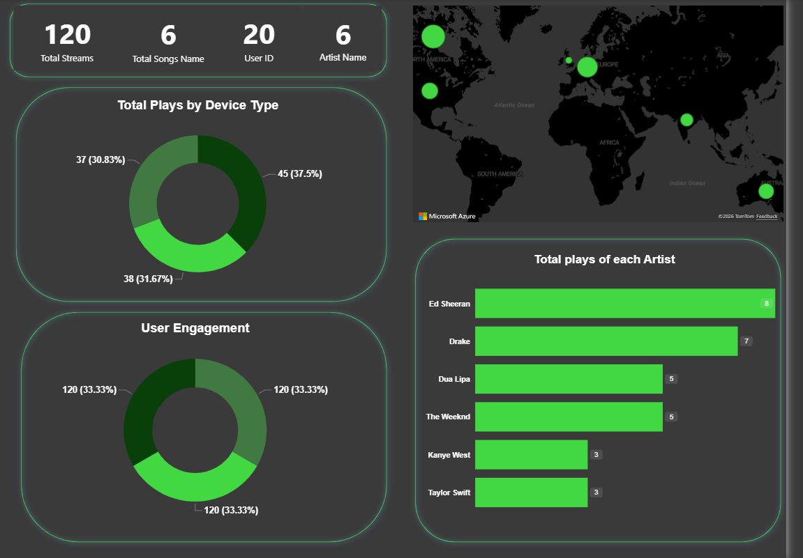

# 🎵 Spotify End-to-End Modern Data Stack (MDS) Streaming Pipeline

An end-to-end data engineering pipeline designed to ingest, process, transform, and visualize simulated real-time Spotify streaming data. This architecture implements a robust **Medallion Architecture** using Docker orchestration to transform raw clickstream logs into production-ready analytical insights.

---

## 🏗️ System Architecture

### Pipeline Blueprint
Below is the structural flow of data as it steps through your containerized local stack from ingestion to business intelligence:

---

## 💾 Medallion Data Models

### 🥈 1. Silver Layer (`main_silver.stg_tracks`)
Cleans, deduplicates, and casts raw unstructured tracking entries into strictly typed SQL primitives while dropping corrupt records.

* **Key Transformations:** String-to-Timestamp casting (`event_timestamp`), explicit string formatting, and validation cleaning on `event_id`.

### 🥇 2. Gold Layer (`main_gold`)
Optimized data marts built to feed analytical dashboards directly without executing heavy queries at run-time.

#### `fact_user_engagement`
Aggregates behavioral clickstream interactions to construct granular, high-performance listener profiles:

| Column Name | Data Type | Description |
| :--- | :--- | :--- |
| `user_id` | VARCHAR | Unique identifier for the streaming listener |
| `country` | VARCHAR | User's geographic location (ISO country code) |
| `device_type` | VARCHAR | Platform device used (e.g., Mobile, Desktop, Tablet) |
| `total_streams` | BIGINT | Total raw log event volume |
| `total_plays` | BIGINT | Aggregated count of completed song 'play' actions |
| `total_skips` | BIGINT | Aggregated count of track 'skip' actions |
| `total_playlist_adds` | BIGINT | Aggregated count of 'playlist_add' actions |
| `unique_songs_listened` | BIGINT | Distinct count of individual tracks consumed |
| `unique_artists_listened`| BIGINT | Distinct count of unique artists discovered |

---

## 🎨 Power BI Executive Analytics Dashboard

The gold analytics data tier connects natively to an executive dashboard layout designed around Spotify's brand visual identity guidelines.

---

## 🛠️ Tech Stack & Environment Architecture

* **Orchestration:** Apache Airflow (Dockerized)
* **Data Warehouse:** DuckDB v1.10+
* **Data Transformation:** dbt-duckdb v1.11+
* **Storage Engine:** MinIO S3 API Object Storage
* **Data Visualization:** Power BI Desktop
* **Local Processing:** Anaconda / Python 3.11 Environment (Pandas, DuckDB native adapters)

---

## 🚀 Deployment & Operational Sequence

### 1. Spin up Core Infrastructure
Start your containerized storage and orchestration layers via Docker Desktop:
```bash
cd docker
docker-compose up -d
### Reporting Features
* **KPI Metrics:** Track overall streaming health, active user counts, and behavioral rates (Skip vs. Play ratio).
* **Segmentation:** Cross-filtering maps user listening patterns to specific device platforms and geographical sectors.
